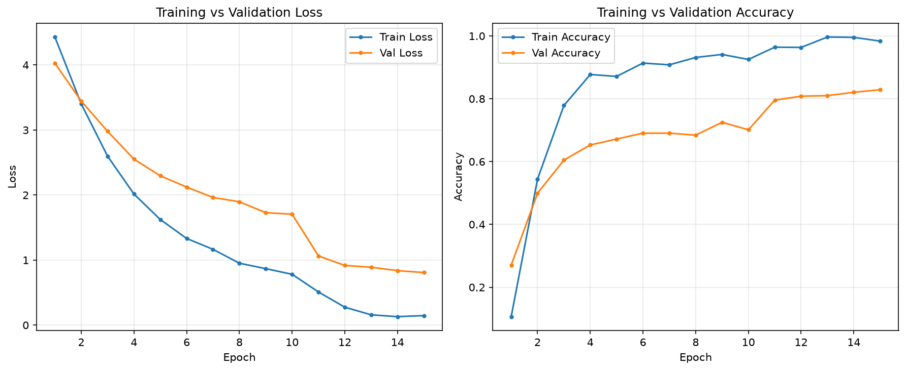
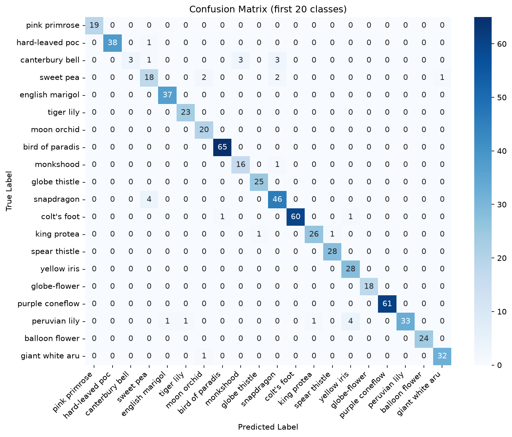

# Transfer Learning Image Classification — Oxford Flowers 102

A complete transfer-learning pipeline for fine-grained flower classification using **EfficientNet-B0** (ImageNet pre-trained) on the **Oxford Flowers 102** dataset.

---

## Project Overview

| Item | Choice |
|------|--------|
| **Dataset** | [Oxford Flowers 102](https://www.robots.ox.ac.uk/~vgg/data/flowers/102/) — 8,189 images, 102 flower species |
| **Model** | **EfficientNet-B0** with ImageNet weights (`torchvision`) |
| **Task** | Multi-class image classification via transfer learning |
| **Framework** | PyTorch + torchvision |

### Why EfficientNet-B0?

For a medium-sized dataset (~1K training images, 102 classes), **EfficientNet-B0** offers the best balance of **accuracy**, **speed**, and **memory**:

| Model | Parameters | ImageNet Top-1 | Notes |
|-------|------------|----------------|-------|
| VGG-16 | ~138M | ~72% | Very heavy, slow inference |
| ResNet-50 | ~25M | ~76% | Strong baseline, more params |
| **EfficientNet-B0** | **~5M** | **~77%** | **Best accuracy/efficiency trade-off** |
| EfficientNet-B4 | ~19M | ~83% | Higher accuracy, slower on CPU |

**EfficientNet** uses *compound scaling* — jointly scaling network depth, width, and input resolution — and **MBConv blocks** with squeeze-and-excitation attention. It extracts rich visual features with far fewer parameters than ResNet/VGG, which reduces overfitting risk when only the classifier head (and optionally top layers) are trained.

### Pipeline Summary

1. **Data** — Official train/test split; train further split 85% / 15% into train/validation
2. **Augmentation** — Random flip, rotation (±15°), color jitter (train only)
3. **Phase 1** — Freeze feature extractor; train new classifier head (10 epochs, Adam lr=1e-3)
4. **Phase 2 (Bonus)** — Unfreeze top 4 MBConv blocks; fine-tune with lower backbone lr (5 epochs, lr=1e-4)
5. **Evaluation** — Test-set accuracy, training curves, confusion matrix

---

## Repository Structure

```
├── .gitignore
├── README.md
├── requirements.txt
├── run_pipeline.py              # End-to-end script (generates figures below)
├── notebooks/
│   ├── transfer_learning_evaluation.ipynb
│   ├── training_curves.png
│   └── confusion_matrix.png
└── src/
    ├── __init__.py
    ├── datasets.py              # Data loading, splits, augmentation
    ├── model_builder.py         # EfficientNet-B0 + classifier head
    ├── engine.py                # Train / evaluate loops
    └── utils.py                 # Plotting & confusion matrix
```

---

## Setup Instructions

### 1. Clone the repository

```bash
git clone <your-repo-url>
cd my_project
```

### 2. Create a virtual environment (recommended)

```bash
python3 -m venv env
source env/bin/activate        # Linux / macOS
# env\Scripts\activate         # Windows
```

### 3. Install dependencies

```bash
pip install -r requirements.txt
```

If PyTorch fails to install, use the official index (CPU example):

```bash
pip install torch torchvision --index-url https://download.pytorch.org/whl/cpu
pip install -r requirements.txt
```

### 4. Run the pipeline

**Option A — Jupyter Notebook (interactive):**

```bash
jupyter notebook notebooks/transfer_learning_evaluation.ipynb
```

Run all cells top-to-bottom. The dataset downloads automatically to `data/` on first run.

**Option B — Python script (reproducible):**

```bash
python run_pipeline.py
```

This trains the model, saves checkpoints to `notebooks/`, and writes `metrics.txt`.

> **Note:** Training on CPU takes ~12 minutes (15 epochs). A CUDA GPU significantly speeds this up.

---

## Results & Visualizations

### Final Test Performance

| Metric | Value |
|--------|-------|
| **Test Accuracy** | **81.70%** |
| **Test Loss** | 0.7671 |
| **Validation Accuracy (best)** | 82.88% |
| **Training epochs** | 15 (10 head + 5 fine-tune) |

> Results from `notebooks/transfer_learning_evaluation.ipynb` (CPU, seed=42). Minor variation between runs is expected.

### Training Curves

Loss and accuracy over 15 epochs (Phase 1 + fine-tuning):



### Confusion Matrix (subset of 20 classes)

Full 102×102 matrix is dense; the plot shows the first 20 flower classes for readability:



---

## Technical Details

### Data Splits

| Split | Images | Purpose |
|-------|--------|---------|
| Train | 867 (85% of official train) | Model training with augmentation |
| Validation | 153 (15% of official train) | Hyperparameter monitoring |
| Test | 6,149 (official test) | Final unbiased evaluation |

### Preprocessing

- Resize to **224×224** (EfficientNet-B0 input size)
- Normalize with ImageNet mean `[0.485, 0.456, 0.406]` and std `[0.229, 0.224, 0.225]`

### Augmentation (training only)

- `RandomHorizontalFlip(p=0.5)`
- `RandomRotation(±15°)`
- `ColorJitter(brightness=0.2, contrast=0.2, saturation=0.2)`

### Model Architecture

```
EfficientNet-B0 (frozen features, then partial unfreeze)
└── classifier:
    ├── Dropout(0.3)
    └── Linear(1280 → 102)
```

### Training Configuration

| Phase | Layers trained | Optimizer | Learning rate | Epochs |
|-------|----------------|-----------|---------------|--------|
| 1 — Head only | Classifier | Adam | 1e-3 | 10 |
| 2 — Fine-tune | Top 4 MBConv + classifier | Adam (2 param groups) | 1e-4 backbone / 1e-3 head | 5 |

**Loss:** `CrossEntropyLoss`

---

## Dependencies

See [`requirements.txt`](requirements.txt):

- `torch`, `torchvision` — deep learning
- `matplotlib`, `seaborn` — visualizations
- `scikit-learn` — metrics & confusion matrix
- `tqdm` — progress bars
- `jupyter` — notebook support

---

## Assignment Requirements Checklist

| Requirement | Status | Location |
|-------------|--------|----------|
| Load dataset | Done | `src/datasets.py`, Notebook Cell 4 |
| Train / Val / Test split | Done | 867 / 153 / 6149 images |
| Resize 224×224 + ImageNet normalization | Done | `get_transforms()` |
| Data augmentation (flip, rotation, jitter) | Done | train transform only |
| Pre-trained ImageNet model | Done | EfficientNet-B0 (`torchvision`) |
| Freeze feature extraction layers | Done | `freeze_features=True` |
| Custom classifier head (102 classes) | Done | Dropout + Linear(1280→102) |
| Loss function + Optimizer | Done | CrossEntropyLoss + Adam |
| Fine-tuning top layers (Bonus) | Done | Phase 2, 5 epochs, lr=1e-4 |
| Training vs Validation curves | Done | `training_curves.png` |
| Test evaluation + Confusion Matrix | Done | Notebook Cell 15 |
| Jupyter Notebook workflow | Done | `notebooks/transfer_learning_evaluation.ipynb` |
| `src/` Python modules (Bonus) | Done | `src/` package |
| `.gitignore` + `requirements.txt` | Done | project root |
| README as standalone report | Done | this file |

---
## GitHub Submission Checklist

- [x] Git repository initialized with structured commits
- [x] `data/` and `env/` excluded via `.gitignore`
- [x] `training_curves.png` and `confusion_matrix.png` committed for README
- [x] Notebook executed with outputs (Cells 4–16)
- [ ] Push to GitHub (`gh auth login` then push — see below)

```bash
~/.local/bin/gh auth login
cd my_project
~/.local/bin/gh repo create transfer-learning-flowers102 --public --source=. --remote=origin --push
```

Replace the repo name and run from your project folder after GitHub login.

---

## Author
Transfer Learning assignment — Image Classification with PyTorch.
